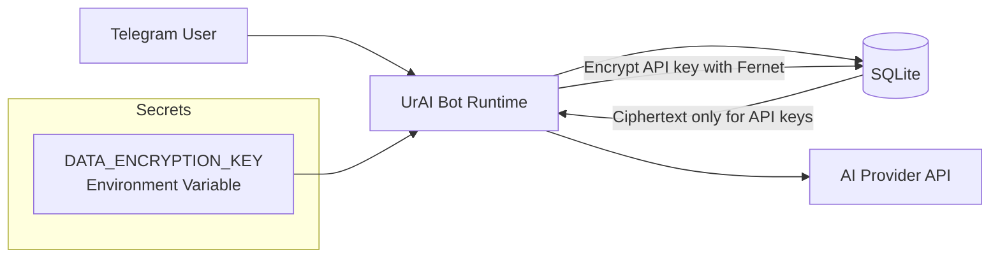
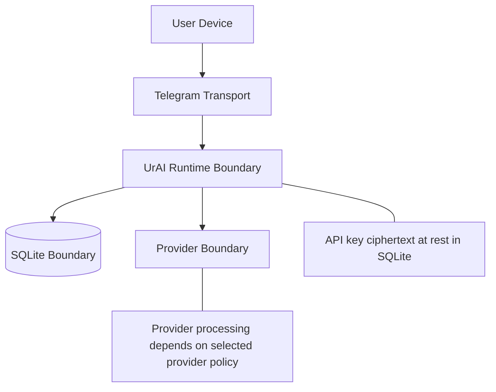

# UrAI Privacy & Encryption Deep Dive


This document is dedicated **only** to privacy and encryption in UrAI.

- Repository: https://github.com/thebitsamuraii23/api-ai
- more learn at: https://github.com/thebitsamuraii23/api-ai/blob/main/PRIVACY_AND_ENCRYPTION.md

## 1) Privacy Scope

UrAI processes multiple data categories. Privacy posture differs by category.

| Data category | Purpose | Storage | Encryption status |
|---|---|---|---|
| User API keys | Authenticate provider calls in Own API mode | SQLite `api_keys.encrypted_key` | **Encrypted with Fernet** |
| Chat messages | Memory/context/history features | SQLite `messages.content` | Stored as application data (not Fernet-encrypted in current schema) |
| User settings | Language/model/provider/personality | SQLite `users` | Stored as config metadata |
| Operational logs | Runtime diagnostics | Stdout/log sink | Metadata-focused in current handlers |

## 2) Encryption Model (What Is Encrypted)

UrAI encrypts user API keys before writing to DB.

- Cryptographic primitive: `cryptography.fernet.Fernet`
- Secret used for encryption/decryption: `DATA_ENCRYPTION_KEY`
- Database field: `api_keys.encrypted_key`

Implementation references in codebase:

- `bot/db.py` imports `Fernet`
- `bot/db.py` initializes cipher suite: `self._fernet = Fernet(encryption_key.encode("utf-8"))`
- API key table persists ciphertext in `encrypted_key`

### Practical consequence

If an attacker only gets DB content (without `DATA_ENCRYPTION_KEY`), encrypted API keys remain unreadable.

## 3) Data Flow Diagram



## 4) API Key Lifecycle

1. User sends `/apikey` input.
2. Bot receives key in runtime memory.
3. Bot encrypts key via Fernet.
4. Bot stores ciphertext in `api_keys.encrypted_key`.
5. On request execution, bot decrypts key in memory.
6. Bot sends provider request and returns result.

Security properties:

- No plaintext API key persistence in DB.
- Decryption depends on deployment secret `DATA_ENCRYPTION_KEY`.

## 5) What Privacy Means in Practice

### API keys

- Protected at rest via Fernet ciphertext.
- Recovery requires valid encryption key.

### Chat content

- Stored for product functionality (history/context).
- This is expected behavior for memory features.
- Separate from API-key encryption path.

### Media (voice/image/files)

- Processed through provider APIs during request handling.
- Privacy outcome depends on chosen provider policies and deployment controls.

## 6) Logging and Privacy

Current handlers are metadata-oriented for normal observability paths, including fields like:

- user id
- provider id
- model
- web search mode
- error status

This helps diagnose incidents without intentionally dumping full message bodies in standard log paths.

## 7) Key Management for `DATA_ENCRYPTION_KEY`

`DATA_ENCRYPTION_KEY` is the crown-jewel secret for API-key decryption.

Recommended controls:

- Keep only in environment variables or a secret manager.
- Never commit to Git.
- Restrict shell and process visibility on host.
- Rotate with migration planning.
- Use separate keys across environments (dev/stage/prod).

Key generation reference:

```bash
python -c "from cryptography.fernet import Fernet; print(Fernet.generate_key().decode())"
```

## 8) Threat Model Snapshot

| Threat | Exposure | Current mitigation | Residual risk |
|---|---|---|---|
| DB leak | API key theft | Fernet ciphertext for API keys | If attacker also steals `DATA_ENCRYPTION_KEY`, keys can be decrypted |
| Server compromise | Process memory/secrets | Depends on deployment hardening | High if host security is weak |
| Misconfigured logging | Sensitive data in logs | Metadata-oriented logging patterns | Logging backend policy still matters |
| Provider-side retention | Third-party processing | Provider API contracts/policies | Varies by provider and account config |

## 9) Deployment Hardening Checklist (Privacy-Critical)

- [ ] Run bot under non-root user.
- [ ] Use firewall allow-list where possible.
- [ ] Store secrets in dedicated secret manager.
- [ ] Restrict DB file permissions.
- [ ] Encrypt backups and protect backup keys.
- [ ] Enable host monitoring and alerting.
- [ ] Maintain patch cadence for OS/runtime dependencies.
- [ ] Define retention policy for DB and logs.
- [ ] Rotate bot/provider secrets on incident.

## 10) Trust Boundaries



## 11) Transparency and Auditability

UrAI is open source, so privacy/encryption behavior is auditable by anyone.

- Repository: https://github.com/thebitsamuraii23/api-ai
- more learn at: https://github.com/thebitsamuraii23/api-ai/blob/main/PRIVACY_AND_ENCRYPTION.md

## 12) FAQ

### Is everything encrypted in the database?

No. In current code, **API keys** are encrypted with Fernet. Chat history is stored for memory/history features.

### Can encrypted API keys be read without server secret?

No, not in practical terms. Decryption requires the correct `DATA_ENCRYPTION_KEY`.

### Can deployment improve privacy further?

Yes. Strong host security, strict access controls, encrypted backups, and minimal log retention significantly improve privacy posture.
